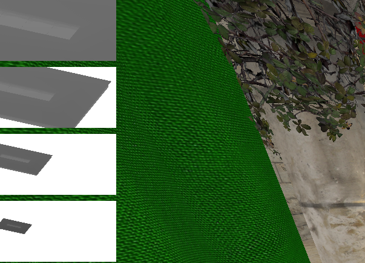

# OpenGL-Project

I completed this project shortly after I graduated in 2020. It was used to get a better understanding of Graphics programming.

## How To Run

Download the project on your machine. Open the solution within your Visual Studio IDE and run the project.
In it's current state, the project will be compiled, however, would encounter an error when running due to missing 
model Emerald Square, which was too large to host on Github, without LFS.

## Features

- Cascaded Shadow Maps with up to 4 cascades
- PCF using Interleaved Gradient Noise
- Phong Lighting
- Normal Mapping
- A Mesh Loader capable of handling large models

## Camera Controls

- Use the AWSD keys to move the camera Forward, Backward, Left and Right.
- Use the Q and E keys to move Up and Down.
- Use the cursor by clicking and dragging in the direction you wish to face.
