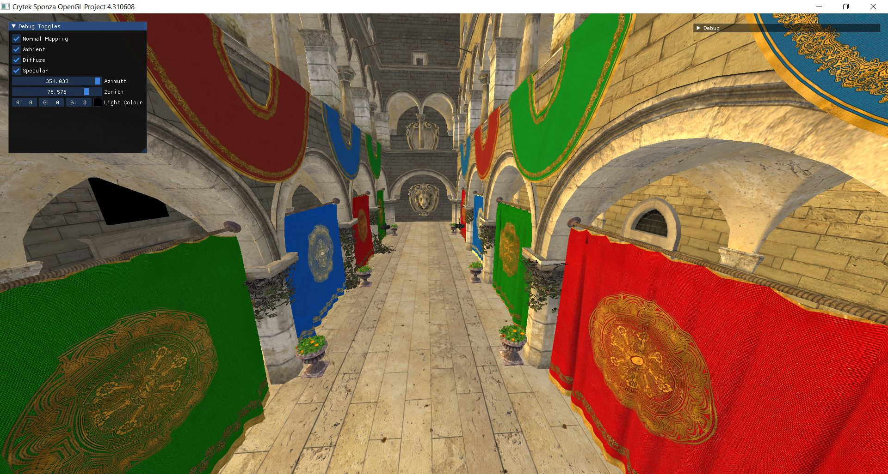
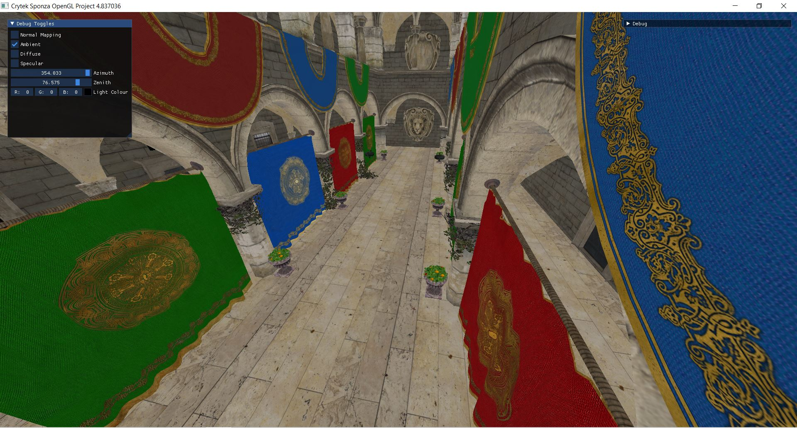
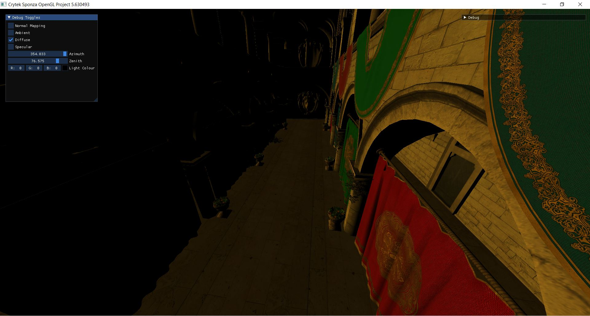
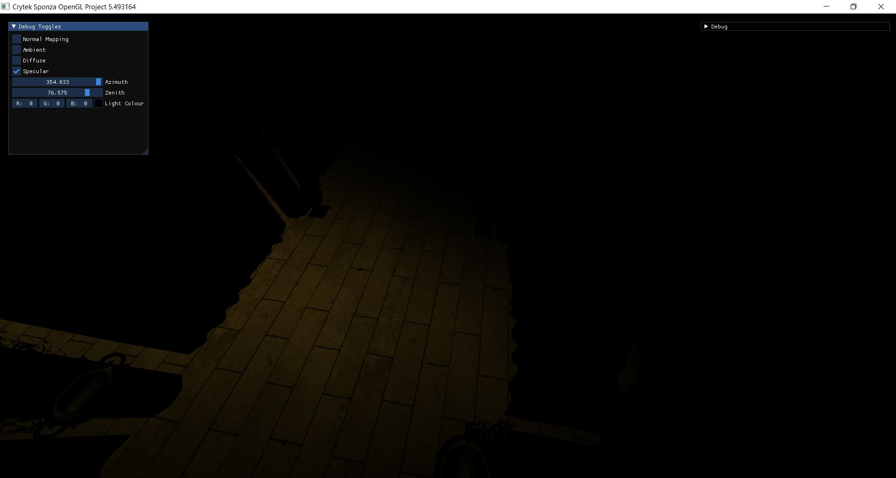
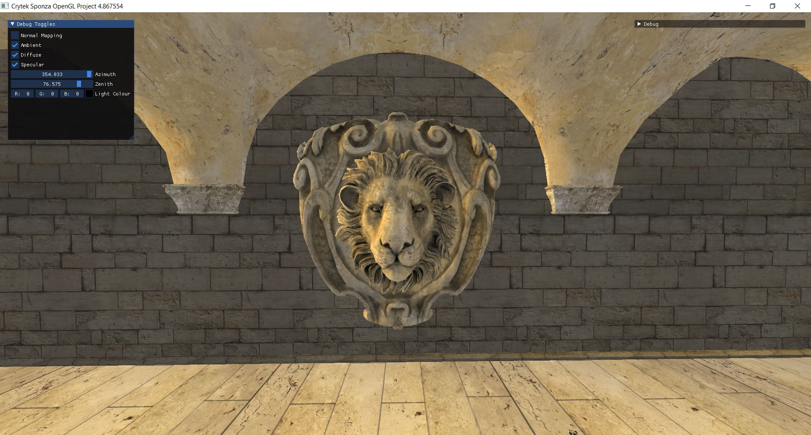
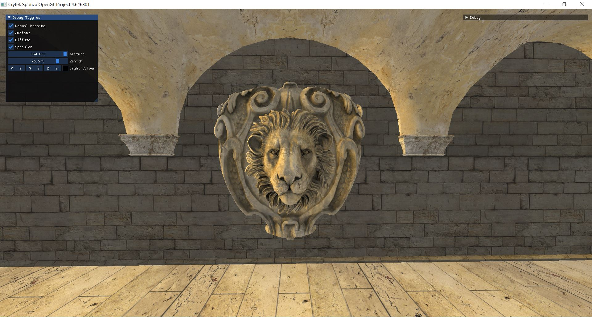

# OpenGL-Project

This is my current and on-going project. It is meant to be a playground for me to test and improve my Graphics programming skills. 

## How To Run

Download the project on your machine. Open the solution within your Visual Studio IDE and run the project.

## Features

- Phong Lighting
- Custom Mesh Loader capable of handling large models with different materials.
- Normal Mapping

## Camera Controls

- Use the AWSD keys to move the camera Forward, Backward, Left and Right.
- Use the Q and E keys to move Up and Down.
- Use the cursor by clicking and dragging in the direction you wish to face.
